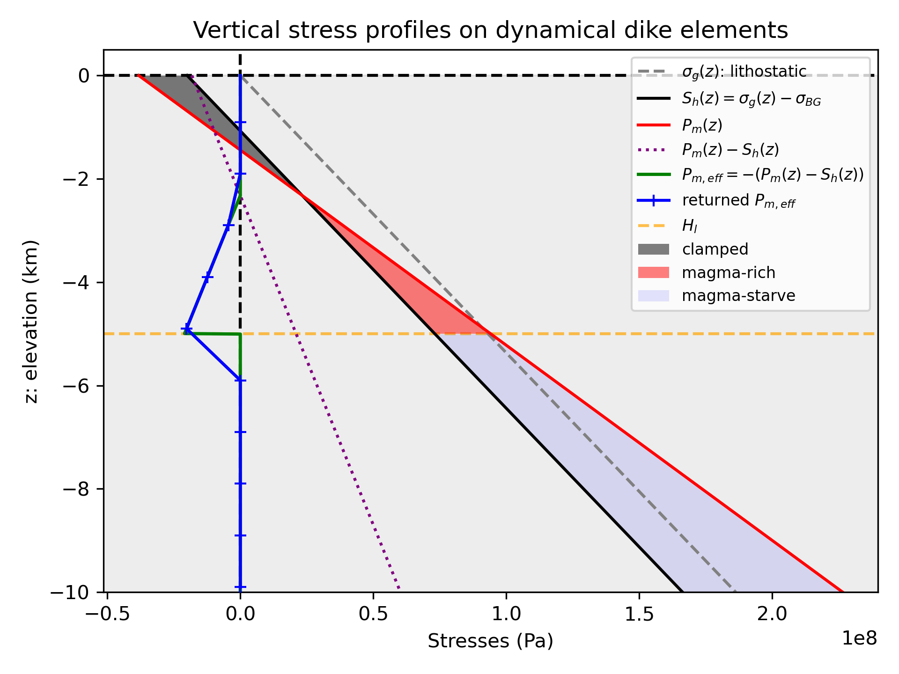
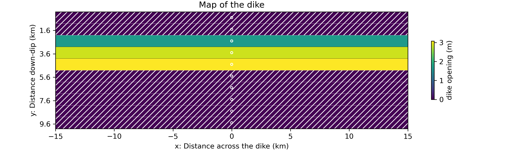
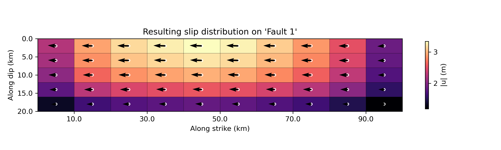
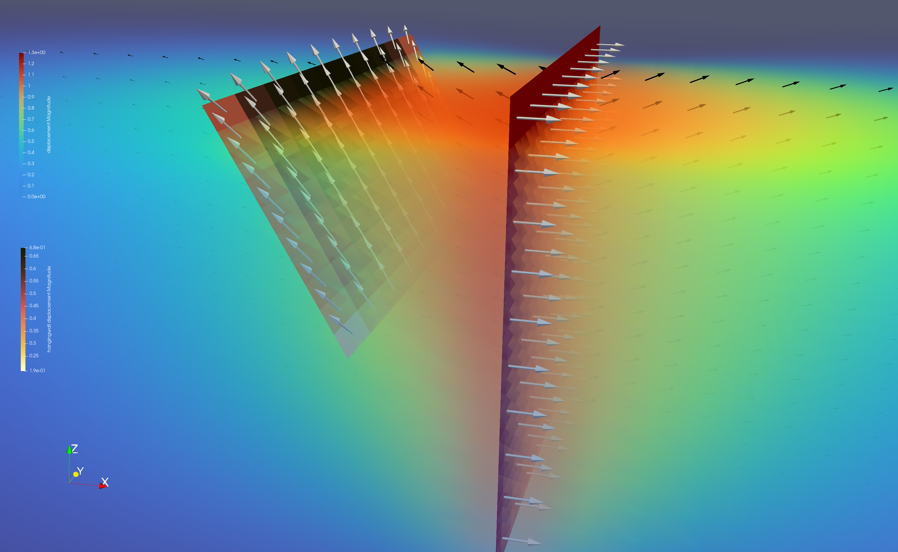
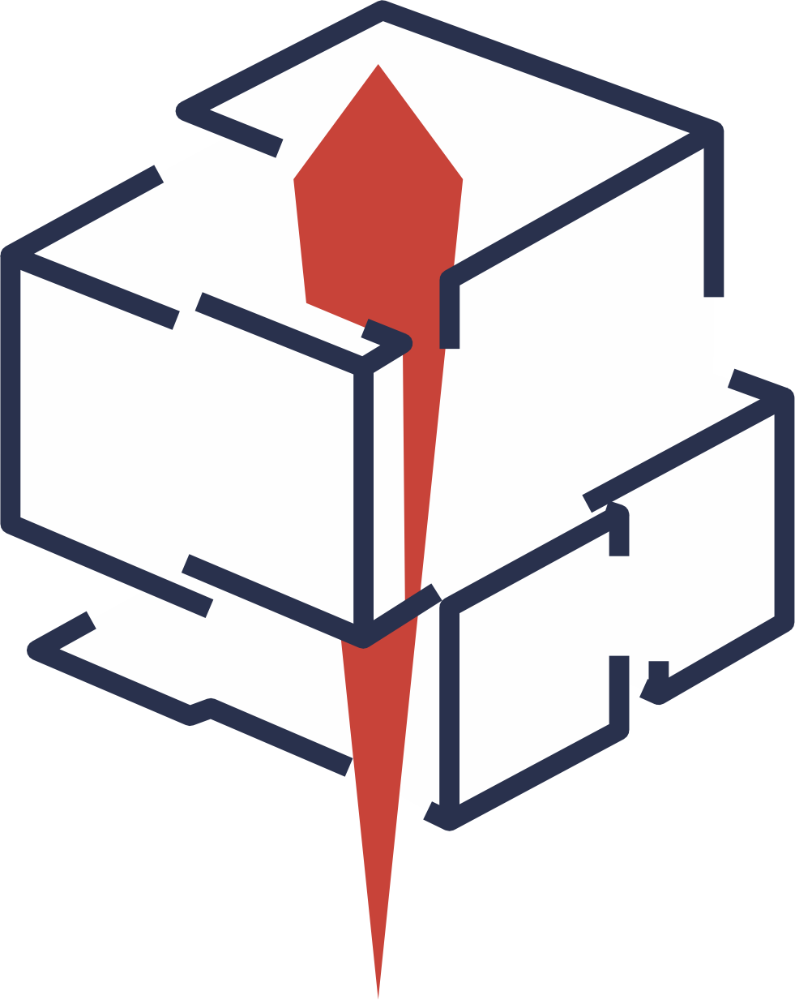

<p align="center">
    
</p>

# geoBEAM
### A 3D Boundary-Element Algorithm for Modelling in Geodynamics
**geoBEAM** is a python package providing a three-dimensional Boundary-Element Model (BEM) to compute stresses, strain, and displacements both within and at the surface of an elastic half-space and on each element (*i.e.* planar rectangular dislocation) with a high-level, user-friendly and explicit interface. The core of **geoBEAM** is based on an adapted version of the BEM [3D~def](http://www.ceri.memphis.edu/people/ellis/3ddef/), originally developed by J. Gomberg and M. Ellis.

The strength of **geoBEAM** lies in the fact that, unlike classical dislocation models, boundary-element approaches treat slip (*i.e.*, the amplitudes of the dislocation components) as unknown variables. These quantities are solved for by minimizing the strain energy of the surrunding medium while satisfying boundary conditions set on either the stress or the displacement on each dislocation surface. By doing this, **geoBEAM** explicitly represents mechanical interactions between dislocations (faults, dikes, sills etc) and between the dislocation and the background deformation, whereas more simple dislocation models typically neglect these interactions and do not incorporate strain-energy minimization.

**geoBEAM** provides a high-level python interface to **3D~def** with full integration into a Python environment. It also includes a library of functions and classes that streamline the creation of dislocation and grid geometries, the management of outputs, and the visualization of results, either directly in Python using **Matplotlib** or through [ParaView](https://www.paraview.org/). In addition, the **geoBEAM** solver introduces several major improvements over the original **3D~def** solver. Through dynamic memory allocation, it achieves improved memory efficiency and computational performance while supporting a wider variety of boundary conditions and more extensive output capabilities. **geoBEAM** also includes frictional dislocations using an iterative solution scheme and dynamic dike elements, for which the dislocations defining the dike are driven by a magmastatic pressure that balances the overpressure in a deep magma chamber with the ambient stress field.
 

## Table of contents:

- [Introduction](#geobeam)
- [Install geoBEAM](#install-geobeam)
    - [Prerequisites](#0-prerequisites)
    - [Download](#1-download)
    - [Compilation with f2py and Meson](#2-compilation-with-f2py-and-meson)
    - [Linking](#3-linking)
    - [Test](#4-test)
    - [Uninstall](#uninstall-geobeam)
- [Use geoBEAM](#use-geobeam)
    - [How does it work?](#how-does-it-work)
        - [Introduction](#introduction)
        - [Solving the deformation](#solving-the-deformation)
        - [Geometry and coordinate systems](#geometries-and-coordinate-systems)
        - [Boundary conditions](#boundary-conditions)
        - [Background deformation](#background-deformation)
        - [Friction](#friction)
        - [Dynamical diking](#dynamical-diking)
        - [Units](#units)
        - [Displacement and stress conventions](#displacement-and-stress-conventions)
    - [How to use geoBEAM?](#how-to-use-geobeam)
        - [Importation and main function](#importation-and-main-function)
        - [Full interface, best practices](#full-interface-best-practices)
        - [Dislocations](#dislocations)
        - [Computational grids](#computational-grids)
        - [Visualisation](#visualisation)
        - [Frictional dislocations](#frictional-dislocations)
        - [Dynamical dike dislocations](#dynamical-dike-dislocations)
    - [Examples](#examples)
- [Cite geoBEAM](#cite-geobeam)
- [Fundings](#fundings)
- [Acknowledgements](#acknowledgements)
- [Contributing](#contributing)
- [References](#references)


## Install geoBEAM:

In this section, we describe how to install **geoBEAM** from the source code available on this page. Please follow the steps below sequentially.

> [!NOTE]
> Although not detailed here, as a best practice we strongly recommend installing **geoBEAM** within a dedicated Python environment, for example using [conda](https://conda.io/projects/conda/en/latest/index.html).

### 0. Prerequisites

Great news: installing geoBEAM is straightforward! All you need is a working Python environment ([Python](https://www.anaconda.com/download), version 3.7 or higher), a Fortran compiler (we recommend [gfortran](https://fortran-lang.org/learn/os_setup/install_gfortran/)), and [pip](https://pip.pypa.io/en/stable/). That’s it! If you’d like to create a dedicated Python environment for **geoBEAM**, you can easily do so using [conda](https://conda.io/projects/conda/en/latest/index.html).

> [!IMPORTANT]
> A working Fortran compiler is essential. You can test yours using the provided [makefile](./src/makefile) in the [./src/](./src/) directory. If you have *gfortran* and want to test it, open a terminal in the [geoBEAM-main/src](./src/) directory (after [downloading](#1-download) the **geoBEAM** package; see the [next section](#1-download)) and run the command `make compile`. For other compilers, simply update the makefile accordingly and execute the same command: `make compile`, if you want to test them.


### 1. Download

Download **geoBEAM** from this page and unzip the archive. Then, move into the main directory of the package:
```
cd geoBEAM-main/
```

### 2. Compilation with f2py and Meson

The source code of **geoBEAM** are written in fortran and need to be compile first. To do so, **geoBEAM** is build to be used with [**numpy f2py**](https://numpy.org/doc/stable/f2py/f2py-user.html) and [**Meson**](https://numpy.org/doc/stable/f2py/buildtools/meson.html).

First, place you in your environement where you want to install **geoBEAM**.

Then, make sure ninja and meson are installed:
```
meson --version
ninja --version
```

Or install them with [pip](https://pip.pypa.io/en/stable/):
```
pip install meson meson-python ninja
```

Then, compile the source code with [**numpy f2py**](https://numpy.org/doc/stable/f2py/f2py-user.html) and [**Meson**](https://numpy.org/doc/stable/f2py/buildtools/meson.html) using the following line in the project directory:

```bash
python -m numpy.f2py --backend meson -c \
    src/global_inputs.f90 \
    src/global_arrays.f90 \
    src/global_outputs.f90 \
    src/3dmain.f \
    src/okada_sub.f \
    src/xyz_output.f \
    -I "$(pwd)/src" \
    -m _all3Ddef
```

It will generate a `.so` file in the project directory. Then,

```bash
rm -f geobeam/_all3Ddef*.so
mv _all3Ddef*.so geobeam/
```

### 3. Linking

To link in a user module directory, use [pip](https://pip.pypa.io/en/stable/) and run 
```
python -m pip install -e . --no-build-isolation
```

### 4. Test

To test that the installation process went well, you can run one of the provided examples located in the directory [examples](./examples/) of the main directory of the package, for instance:
```
python examples/Ex01_Dike-induced-faulting.py
```

> [!NOTE]
> If you installed **geoBEAM** in a specific environement, make sure to have it active before running python.

### Uninstall geoBEAM:

As you used [pip](https://pip.pypa.io/en/stable/) for the installation, use it to uninstall the package (in the appropriate environement). In a terminal, run:
```
python -m pip uninstall geobeam
```

$\rightsquigarrow$ [Back to the Table of Content](#table-of-contents)

## Use geoBEAM:

### How does it work?

#### Introduction

**geoBEAM** is a three-dimensional Boundary-Element Model adapted from **3D~def** and allowing computing stresses, strains, displacements and more within and on the surface of a flat elastic half-space (no bottom to the model at depth and no topography) as well as on (across) the dislocation themselves. The strength of this model is that, unlike more simple implementations of *Okada's (1992)* solution, the dislocations representing discontinuities in the elastic medium can be set with either boundary conditions in displacement or stress. 

In **geoBEAM**, a **dislocation represents a surface of constant slip**. Displacements are discontinuous across the dislocations but stresses are continuous everywhere (across the dislocation and everywhere in the gridded medium: continuity of tractions).

**geoBEAM** solves the displacement across the dislocations by minimizing the strain energy in the surrounding medium while satisfying the boundary conditions in either stress or displacement applied on each dislocation surface. Doing this, the model explicitly accounts for the interactions between dislocations and with the background deformation.

$\rightsquigarrow$ [Back to the Table of Content](#table-of-contents)

#### Solving the deformation

In **geoBEAM**, the deformation can be driven by several drivers:
 - A background far field tectonic deformation field: *e.g.* applying an homogeneous shear stress on the whole domain
 - Active dislocations where a fixed displacement across the dislocation is imposed: *e.g* a vertical dislocation opening by 1 meter and simulating the opening of a dike
 - The stress boundary conditions applied by the user on a given dislocation: if no stress is applied elsewhere, non-null stress boundary conditions on a dislocation will induce deformation on the surrounding material due to continuity of tractions.

The type of boundary conditions applied on dislocations will guide the way **geoBEAM** will solve the deformation across them and in the surrounding elastic medium. In **geoBEAM** each dislocation can be associated to either a slip or a stress boundary condition (detailed below in [Boundary conditions](#boundary-conditions)).

When the boundary conditions on a given dislocation are in stress, **geoBEAM** will compute the driving stresses that will lead to a displacement condition on this dislocation. The stress boundary conditions imposed on a dislocation are **ending** (*i.e.* final) conditions (except for frictional dislocation, see [Friction](#friction)), that is, the stress the dislocation reaches after displacement (by continuity of tractions, the stress in the surrounding elastic medium across the center of a given dislocation corresponds to the final stress on this dislocation.The driving stress solved by **geoBEAM** then takes the following form:

$$\Delta\tau = \tau_f - \tau_{ext}$$

where $\Delta\tau$ represents the driving stresses, $\tau_f$ the imposed (final) stress boundary conditions and $\tau_{ext}$ the resultant of the external forces, *i.e*, the background tectonic deformation and the slip on other dislocations.

The deformation (displacement) across the dislocations, when knowing the stress applied on it, is resolved as a set of linear equations. For each dislocation number $i$, the displacement **across** the dislocation (strike slip $D^s_i$, dip slip $D^d_i$, tensile slip $D^n_i$) and stress (shear stresses in the along-strike direction $\tau^s_i$, in the along-dip direction $\tau^d_i$, and the stress normal to the dislocation $\sigma^n_i$) is specified **at it's center**.

> [!IMPORTANT]
> The boundary conditions set on dislocations are true only at the center of the dislocation.

> [!NOTE]
> The superscripts $^s$, $^d$ and $^n$ will refer hereinafter to along-strike, along-did and along-normal directions, respectively.

The set of equations solved can be written in matrix form as follows:

$$\mathbf{T} = \mathbf{A}\cdot\mathbf{D}$$

where $\mathbf{\Tau}$ is the stress vector, $\mathbf{A}$ is the matrix of the Green coefficients computed using the *Okada (1992)* routines and $\mathbf{D}$ the vector of total displacements **across** each dislocation. Here, the operator $\cdot$ represent the dot product. This relationship between stresses and displacements can be used in both direction, *i.e.* knowing the stresses and computing the displacements (by inverting $\mathbf{A}$) or, knowing the displacements and looking for the stresses generated by them.

When developped for $n$ dislocations, this stress-displacement relationship takes the following form:

```math
\left[ \begin{matrix}
\tau^s_1 \\
\tau^d_1 \\
\sigma^n_1 \\
\cdots\\
\tau^s_n \\
\tau^d_n \\
\sigma^n_n
\end{matrix} \right] = 
\left[ \begin{matrix}
A^{ss}_{11}, A^{sd}_{11}, A^{sn}_{11}, \cdots, A^{ss}_{1n}, A^{sd}_{1n}, A^{sn}_{1n}\\
A^{ds}_{11}, A^{dd}_{11}, A^{dn}_{11}, \cdots, A^{ds}_{1n}, A^{dd}_{1n}, A^{dn}_{1n}\\
A^{ns}_{11}, A^{nd}_{11}, A^{nn}_{11}, \cdots, A^{ns}_{1n}, A^{nd}_{1n}, A^{nn}_{1n}\\
\cdots \\
A^{ss}_{n1}, A^{sd}_{n1}, A^{sn}_{n1}, \cdots, A^{ss}_{nn}, A^{sd}_{nn}, A^{sn}_{nn}\\
A^{ds}_{n1}, A^{dd}_{n1}, A^{dn}_{n1}, \cdots, A^{ds}_{nn}, A^{dd}_{nn}, A^{dn}_{nn}\\
A^{ns}_{n1}, A^{nd}_{n1}, A^{nn}_{n1}, \cdots, A^{ns}_{nn}, A^{nd}_{nn}, A^{nn}_{nn}\\
\end{matrix} \right] 
\left[ \begin{matrix}
D^s_1 \\
D^d_1 \\
D^n_1 \\
\cdots\\
D^s_n \\
D^d_n \\
D^n_n
\end{matrix} \right]
```

In **geoBEAM**, resolve the displacement across each dislocations. Then, then resulting displacements are used to compute analytically the deformation throughout the surrounding elactic medium.

> [!TIP]
> A numerical error will occur if a point of the computational grid (used to compute the solution in the surrounding medium) lies exactly on a dislocation. This comes from the fact that the dislocations are singular planes where the solution is not defined.

$\rightsquigarrow$ [Back to the Table of Content](#table-of-contents)

#### Geometries and coordinate systems

**geoBEAM** uses the cartesian **x-(East), y-(North), z-(Up)** system to describe the coordinates and the **along-strike, along-dip, along-normal** to describe displacements and stresses in addition to the cartesian system. Both coordinates system verified the right-hand convention.

> [!NOTE]
> By definition, the footwall lies under the hangingwall. When looking in the strike direction, the fault dips to the right and the hanging wall is then on the right.

Dislocations are represented as rectangular patches, each defined by a width (along dip), a length (along strike), an origin ($X_0, Y_0, Z_0$), a strike (azimuth measured clockwise from north), and a dip (angle measured to the right of the strike direction; 0° = horizontal, 90° = vertical).

> [!NOTE]
> A main difference between **geoBEAM** and **3D~def** is that **geoBEAM** does not use *sub-elements* (*i.e.* sub-dislocations), but only *elements* (*i.e* dislocations), in order to provide a more homogeneous and lower-level definition of the dislocation geometry. If you want a result with more elements, implement them as dislocations.

**geoBEAM** describes the displacements at a given dislocation as either **relative** displacements (dispalcements across the dislocation: the total slip in every direction) or **absolute** displacements (displacements of one side of the fault relative to its original position and not relative to the other side of the fault). Relative displacements if the $i^{th}$ dislocation are written $D_i^k$ whereas the absolute displacements are written $u_i^k$ (notation used here and by J. Gomberg and M. Ellis in the [official documentation of 3D~def](http://www.ceri.memphis.edu/people/ellis/3ddef/)). The relation between the absolute and relative displacement can be simply express by:

```math
D_i^s = u_{i_-}^s - u_{i_+}^s \\
D_i^d = u_{i_-}^d - u_{i_+}^d \\
D_i^n = u_{i_-}^n - u_{i_+}^n
```
The subscripts $-$ and $+$ refer to the absolute displacement of the **footwall** and **hangingwall**, respectively..

The distinction between absolute and relative displacements is crucial.

$\rightsquigarrow$ [Back to the Table of Content](#table-of-contents)

#### Boundary conditions

Discontinuities are user-defined for each dislocation in the reference frame of dislocation (along-strike, along-dip, along-normal). The following table summarizes the different options available. Note that several options have been added from the original version of **3D~def**. For readability, the superscipts below and subscripts are inverted. Superscipts describe the absolute motion of the walls ($^-$ for the footwall and $^+$ for the hangingwall) and the subscripts the directions.

| Code | Strike Dir. | Dip Dir. | Normal Dir.|
| :---: | :---: | :---: | :---: |
| 1  | $$u_{s}^{-}$$ | $$u_{d}^{-}$$ | $$u_{n}^{-}$$ |
| 2  | $$\tau_{s}$$ | $$\tau_{d}$$ | $$\sigma_{n}$$ |
| 3  | $$\tau_{s}$$ | $$u_{d}^{-}$$ | $$\sigma_{n}$$ |
| 4  | $$u_{s}^{-}$$ | $$\tau_{d}$$ | $$\sigma_{n}$$ |
| 5  | $$\tau_{s}$$ | $$\tau_{d}$$ | $$u_{n}^{-}$$ |
| 6  | $$u_{s}^{-}$$ | $$u_{d}^{-}$$ | $$\sigma_{n}$$ |
| 10 | $$D_{s}$$ | $$D_{d}$$ | $$D_{n}$$ |
| 11 | $$\phi$$ | $$\tau(\phi)$$ | $$D_{n}$$ |
| 12 | $$\tau_{s}$$ | $$\tau_{d}$$ | $$D_{n}$$ |
| 13 | $$\tau_{s}$$ | $$D_{d}$$ | $$D_{n}$$ |
| 14 | $$D_{s}$$ | $$\tau_{d}$$ | $$D_{n}$$ |
| 15 | $$D_{s}$$ | $$D_{d}$$ | $$\sigma_{n}$$ |

The difference between absolute displacement and relative displacement is crucial here. 

> [!WARNING]
> A confusion between absolute displacement and relative displacement will lead to a wrong result.

For *code=11*, the user specifies a stress magnitude $\tau(\phi)$ and the direction of shear $\phi$ as an angle measured from the strike direction (in *deg*). Then, the code resolves these conditions into shear stress conditions in the strike and dip directions.

> [!IMPORTANT]
> For **frictionless dislocations**, boundary conditions represent the **final** displacements/stresses the user want to specified at the center of patches. In this case, boundary conditions are **ending conditions**. For example, a frictionless dislocation defined by the boundary conditions (code = 12, $\tau_{s} = 0$, $\tau_{d} = 0$, $D_{n} = 0$) produces a displacement field governed by the requirement that, at the end, no stress remains on the fault plane and no tensile opening occurs. For **frictional dislocations**, only **code=2** is possible and boundary conditions are the **initial stresses** on the fault (stresses stored on the fault). See the specific section about [Friction](#friction) for more details.

$\rightsquigarrow$ [Back to the Table of Content](#table-of-contents)

#### Background deformation

**geoBEAM** allows the users to specify a background deformation field that will act as a driver (or as an *additional* driver) of deformation. The background deformation field can be specified as either a stress, strain, or displacement gradient tensor (internally these tensors are converted to a stress tensor).

> [!NOTE]
> Use of a background stress or strain tensor will have no affect on the dislocation relative displacements if you use the boundary conditions codes 1 or 10 for your dislocation because these boundary conditions do not involve stresses.


$\rightsquigarrow$ [Back to the Table of Content](#table-of-contents)

#### Friction

When using **geoBEAM**, the user specify a coefficient of internal friction for the surrounding elastic medium. This is coefficient is only used to determine potential failure planes, assuming a Coulomb failure criterion. The user have to enter a value for this coefficient, but this is independant of the frictional behavior of dislocation.

**geoBEAM** allows to use friction for dislocations, specifically in the sense of Mohr–Coulomb friction. A frictional dislocation $i$ slides (relative displacement) only
when

$$|\tau_i| > \mu_i |\sigma_{n,i}| + C_i$$

where $C_i$ and $\mu_i$ are the friction coefficient and the cohesion at the dislocation $i$, respectively, and where

$$|\tau_i|=\sqrt{(\tau_i^s)^2+(\tau_i^d)^2}$$

We write $\tau_{c,i}$ the critical stress at the dislocation $i$, that is the stress on the envelope such that,

$$\tau_{c,i} = \mu_i |\sigma_{n,i}| + C_i$$

We write the excess of stress

$$\Delta\sigma_{e,i}=|\tau_i| - (\mu_i |\sigma_{n,i}| + C_i) = |\tau_i| - \tau_{c,i}$$

the stress *exceeding* the Mohr-Coulomb envelope.

By defaults, dislocations are frictionless (below, `fcode=0`). To specify that specific dislocations are frictional, the user can set a specific value to the parameter `fcode` and enter an appropriate set of frictional parameters. The following table summarizes the different options available.

> [!NOTE]
> Frictional dislocation *stores* stress if the failure criterion is not met. Below, when we say 'release' for a stress, it means that the stress is driving the deformation and used to slip (relative displacement on the dislocation), contrary to the stress stored on the dislocation.

| fcode | Comment |
| :---: | :---: |
| 0 | No friction, the patch is considered frictionless. The other frictional parameters (i.e. `sdrop`, `C`, `mu`, etc) have no effect. |
| 1 | If failure, releases a fraction `sdrop` of the excess of stress $\Delta\sigma_e$ (*e.g.* `sdrop=0`: no release (locked), `sdrop=1`: back on the failure envelope if sliding *i.e.* means that, if the failure is reached a stress $\tau_c$ is stored on the dislocation (ending stress condition) and $\Delta\sigma_e$ is converted into displacement). |
| 2 | If failure, releases a fraction `sdrop` of the total stress $\tau$. (*e.g.* `sdrop=0.5`: release half of the total stress (may still be above the failure envelope), `sdrop=1`: release all the stress: no more stress on the dislocation (become frictionless)). |
| 3 | If failure, releases all the excess stress $\Delta\sigma_e$ plus a fraction `sdrop` of the stress envelope. *i.e.* release: $\Delta\sigma_e$ + `sdrop` $\times \tau_c$ |
| 4 | If failure, releases all the excess stress $\Delta\sigma_e$ plus an absolute stress `sdrop` (unit of `sdrop`: same as `E`). Release: $\Delta\sigma_e$ + `sdrop` |
| 5 | If failure, releases an absolute stress `sdrop` (unit of `sdrop`: same as `E`). Release: `sdrop` |


**geoBEAM** iteratively solves the deformation induced by frictional dislocations following an approach similar to Rubin (1992). At each iteration, the stress on every dislocation is re-evaluated by accounting for the background deformation, the driving dislocation (*e.g.*, a dike), and the stresses induced by the slip of neighboring dislocations, whether frictionless or frictional and having reached failure. During successive iteration, displacements on each dislocations are added until reaching convergence defined by a given tolerence `tol` or a maximum number of iterations `maxiter`. During each iteration, cycling through all dislocations and testing their failure condition (with the background stresses, driving dislocations and stresses induced by the sliding of elements at the preceding iteration) before accounting for the stresses induced the sliding of neighbouring elements (during this same dislocation), ensures that the sequence in which the dislocation are considered does not affect the result (Rubin (1992)).

> [!TIP]
> The convergence of the solver is defined by a tolerance `tol=0.1` cm, by default. This means that iterations proceed until all components of the displacement vector $(D^s_1, D^d_1, D^n_1, \cdots, D^s_n, D^d_n, D^n_n)$ vary by less than `tol=0.1` cm. User can change `tol` as well as the maximum number of iteration `maxiter`.

The scheme implemented in **geoBEAM** enables the resolution of complex triggering scenarios. For example, dislocation A may slip while dislocation B remains locked; however, by the end of the iteration, the stress on B may become incompatible with a locked state, indicating that B is unstable and should also slip.

> [!IMPORTANT]
> For a given frictional dislocation, when not all the excess stress $\Delta\sigma_e$ is realeased at the failure (*e.g.* `fcode=1` and `sdrop=1/2`,  *i.e.* partial stress drop, smaller than $\Delta\sigma_e$), the solver will detect the instability of the firctional state of the dislocation and, iteration after iteration, the solver will bring the stresses on the dislocation to the Mohr-Coulomb envelope (in the case of `fcode=1`), satisfying the set stress drop conditions, the tolerance and the maximum number of iteration.

The lithostatic pressure is taken into account in **geoBEAM** to evaluate the failure criterion (will not generate motion on itself). The normal stress on each dislocation (calculated from the background deformation, the initial stress, the driving dislocation etc) is corrected to add the lithostatic stress $\sigma_g(z)$,

$$\sigma_g(z)=(\rho_{r}-\rho_f)gz$$

where $\rho_r$ and $\rho_f$ are the average rock and fluid densities (parameters `rhoLitho` and `rhoFluid`, respectively), $g$ the gravitational acceleration and $z$ the depth of the center of the dislocation.

> [!TIP]
> To cancel the gravity and fluid effect on the failure criterion evaluation: `rhoLitho=0`,  `rhoFluid=0`

Thus, to summarized, in **geoBEAM**, frictional elements are parametrized with the 6 following options: the friction code `fcode`, the stress drop parameter `sdrop`, the local friction coefficient `mu`, the cohesion `C`, the average rock density `rhoLitho` and the average fluid density `rhoFluid`.

> [!TIP]
> Check the section [Frictional dislocations](#frictional-dislocations) for more details on how to implement frictional dislocations in your python script using **geoBEAM**.


$\rightsquigarrow$ [Back to the Table of Content](#table-of-contents)


#### Dynamical diking

Complementary to the [friction](#friction), **geoBEAM** allows the user to define dislocations as *dynamical dikes* elements, where the solver will ensure that the pressure inside the different dike's elements are at magmastatic pressure (when *open*). This assumption is justified as, during a dike intrusion, the low viscosity of the hot magma and the relatively slow rate of thermal diffusion lead to a characteristic timescale over which the magma remains fully molten and nearly homogeneous that is significantly longer than that associated with the processes modeled using a BEM, which assumes a quasi-instantaneous elastic response of the surrounding medium.

Thus, the magma pressure $P_m(z)$ in the dike at a depth $z$ ($z<0$ below the surface in the **geoBEAM** reference frame) can be expressed following *Quin and Buck (2008)* as:

$$P_m(z)=P_{m0}+\rho_mg(H_l-z)$$

where $H_l$ ($<0$) is the depth of the magma chamber where the dike theoretically originates, $\rho_m$ the average magma density, $g$ the gravitational acceleration and $P_{m0}$ the pressure inside this magma chamber. This equation can be rewritten to express $P_{m0}$ as a function of $\Delta P_{m0}$, the overpressure inside this magma chamber relative to the ambient lithostatic pressure $\sigma_g(z)$, leading to,

$$P_m(z)=\sigma_g(H_l)+\Delta P_{m0}+\rho_mg(H_l-z)$$

where $\sigma_g(z)=-(\rho_{r}-\rho_f)gz$, with $\rho_r$ and $\rho_f$ being the average rock and fluid densities, respectively.

When **geoBEAM** solves the stresses on dynamical dike elements $\Delta\tau = \tau_f - \tau_{ext}$ (see [Solving the deformation](#solving-the-deformation)), the lithostatic stresses is removed to not take it into account as potential driving stress, leading to,

$$\tau_f=-(P_m(z)-\sigma_g(z))=\sigma_g(z)-P_m(z)$$

**geoBEAM** then computes the contribution of all remaining stress components, $\tau_{ext}$ (*e.g.*, background tectonic deformation), acting on the dynamical dike dislocations to determine the net driving stress, $\Delta\tau$. For a given dynamical dike dislocation $i$, if $\Delta\tau_i < 0$, the resultant forces promoting dike opening exceed the lithostatic pressure tending to close it. In this case, the dike element is considered *open* and it's normal stress will be $\tau_f$ (no along-strike or along-dip stresses). It's boundary condition will be `kode=15` with $D_s=0$ and $D_d=0$ (tensile, mode I opening). Else, if $\Delta\tau_i \geq 0$, the lithostatic pressure dominates over the resultant of forces promoting dike opening and the dike's element is considered *closed*. It's boundary condition will be `kode=10` with all the three displacements set to zero ($D_s=0$, $D_d=0$ and $D_n=0$).

**geoBEAM** resolves the complex stress interactions between dislocations, automatically accounting for the clamping or promotion of opening of dynamical dike elements resulting from slip on surrounding dislocations. The model also captures their interactions with the nonlinear mechanical behavior of frictional dislocations.

<p align="center">
    
</p>

*Figure showing vertical stress profiles for a dike composed of 10 vertically stacked dynamical dike elements. $\sigma_g(z)$ denotes the lithostatic pressure, $S_h(z)$ the horizontal stress, and $\sigma_{BG}=2\times10^7$ Pa the background stress applied normal to the dike walls, promoting dike opening. $P_m(z)$ represents the magmastatic pressure within the dike (following the formulation of Quin and Buck, 2008; see equations above), and $P_{m,\mathrm{eff}}$ is the effective normal stress acting on the dike elements. The blue curve shows the driving stress computed by geoBEAM, evaluated at the center of each element (blue crosses). The orange horizontal line marks the depth of the magma chamber, $H_l$. The black, red, and blue shaded regions indicate portions of the dike where: (1) the dike remains closed due to lithostatic clamping stresses; (2) the dike is open and its internal pressure is magmastatic; and (3) the dike elements lie below $H_l$, where magma supply is insufficient to maintain magmastatic conditions (magma-starved region). (Figure generated with **geoBEAM**)*

<p align="center">
    
</p>

*Figure showing the resulting opening profile on the dynamical dike (30 km along-strike and 10 km down-dip) of the previous figure. White circles highlight the centers of the dislocations. (Figure generated with **geoBEAM**)*


$\rightsquigarrow$ [Back to the Table of Content](#table-of-contents)


#### Units

**geoBEAM** and **3D~def** use the same units. Units are defined in the table below:

| Features | Units |
| :---: | :---: |
| Dislocation geometry | km |
| Computational grid geometry | km |
| Dislocation displacements | cm |
| Stresses | same as the input Young's modulus |
| Strain | - |
| Angles | degree |
| Densities | consistent with the stresses |

> [!TIP]
> It is recommended to use **Pa** as unit of the Young's modulus so that it becomes the unit of all the stresses (input: like the in background stress, boundary conditions, and output: on the grid and on the dislocation), and densities become kg.$\text{m}^{-3}$.


$\rightsquigarrow$ [Back to the Table of Content](#table-of-contents)

#### Displacement and stress conventions

Conventions on the displacement:

| Component | Sign | Displacement |
| :---: | :---: | :---: |
| Strike | $>0$ | left-lateral |
| Strike | $<0$ | right-lateral |
| Dip | $>0$ | thrust |
| Dip | $<0$ | normal |
| Normal (tensile) | $>0$ | opening |
| Normal (tensile) | $<0$ | closing |

Conventions on the stress:

| Sign | Syle |
| :---: | :---: |
| $<0$ | Compression |
| $>0$ | Extension |

$\rightsquigarrow$ [Back to the Table of Content](#table-of-contents)


### How to use geoBEAM?

In this section we will detail how to use the main features of **geoBEAM**. A complete set of commented examples using these features are provided in the directory [examples/](./examples/). Examples are detailed in the section [Examples](#examples).

**geoBEAM** is designed to be used through its **full interface** in order to take advantage of all available features. We strongly encourage users to adopt this approach and to consult the section [Full interface, best practices](#full-interface-best-practices).

> [!TIP]
> The functions and classes of **geoBEAM** have a documentation! You can check their description, arguments, outputs *etc*, using the function `help` for instance:
```python
import geobeam

help(geobeam.compute3Ddef)
```


#### Importation and main function

When installed and linked to your python environnement as shown above in the section [Install geoBEAM](#install-geoBEAM), **geoBEAM** can be imported with:

```python
from geobeam
```

**geoBEAM** is structured to have a main function `geobeam.compute3Ddef` to solve the stresses, strains, and displacements from a set of initial conditions (a population of dislocation, a set of points in the surrounding elastic medium). 

```python
from geobeam import compute3Ddef
```

The function `geobeam.compute3Ddef` takes in input all the information about the geometry of the points where the solution should be computed and the geometry and boundary condition on each dislocation and returns the result as a tuple of python objects, one per type of output. The call of the function will look like:

```python
# Example without background deformation

u,s,e,o,f,j,g,d,fstatus,runParam = \
    compute3Ddef(x,y,z,\
                 xd,yd,zd,length,width,strike,dip,\
                 kode,ss,ds,ts,\
                 nu,E,mu)
```

where the input variable `xd,yd,zd,length,width,strike,dip` define the geometry of each patch (in *deg* for the strike and the dip and in *km* for the others), `kode,ss,ds,ts` define the type of boundary conditions (see next paragraph) applied on each patch (*i.e.* slip in the strike direction, stress in the dip direction, etc.), `nu` is the Poisson's ratio. `x`, `y`, `z` (in *km*) are the coordiantes of the set of points where the analytical solution is computed
The outputs computed by the functions are: `u` the displacement field (in *cm*) on the input grid, `s` the stress (unit of the Young's modulus `E`, *e.g. Pa*), `e` the strain, `o` orientations of principal strains , `f` the optimal failure planes (in *deg*), `g` the displacement gradients, `d` the relative displacements ($D_i^k$ with our notations) on each dislocation (in *cm*), `fstatus`, the frictional status of each element and `runParam`, the run status parameters.

> [!NOTE]
> Using the full **geoBEAM** interface provides an alternative way to solve the deformation problem. The workflow becomes clearer, more intuitive, and fully object-oriented. However, under the hood, the function `geobeam.compute3Ddef` is still called.

Each of the output of `geobeam.compute3Ddef` has a specific type whose the properties are listed in the table below.

Results on the computational grid:

| Variable | Type | Numerical Type  | Fields | Comments |
| :---: | :---: | :---: | :---: | :---: |
| `u` | Vectorial | `geobeam.GridDisplacement` | `.x`, `.y`, `.z` |  |
| `s` | Tensorial (symmetric) | `geobeam.GridStress` | `.xx`, `.xy`, `.xz`, `.yx`, `.yy`, `.zz`, `.zx`, `.zy`, `.zz`|  |
| `e` | Tensorial (asymmetric) | `geobeam.GridStrain` | `.xx`, `.xy`, `.xz`, `.yx`, `.yy`, `.zz`, `.zx`, `.zy`, `.zz`|  |
| `o` | Tensorial (asymmetric), ***optional*** (flag `output_pstrainOri`)| `geobeam.GridPrincipalStrainOrientation` | `.ex`, `.px`, `.tx`, `.ey`, `.py`, `.ty`, `.ez`, `.pz`, `.tz`| magnitude of the max. principal strain (`e`), plunge with respect to horizontal of the max. principal strain (`p`), trend (clockwise with respect to North) of the max. principal strain (`t`)|
| `f` | Vectorial (double), ***optional*** (flag `output_fplane`) | `geobeam.GridOptimalFailurePlane` | `.str1`, `.dip1`, `.rak1`, `.str2`, `.dip2`, `.rak2`| strike (`str`), dip (`dip`) and rake (`rak`) for the two possible failure planes labelled 1 and 2 |
| `j` | Vectorial, ***optional*** (flag `output_invariants`) | `geobeam.GridStressStrainInvariants` | `.volchg`, `.critic`, `.octshr`, `.work`| volume change (volumetric strain): `.volchg`, critical failure stress `.critic`, octahedral shear stress `.octshr`, strain energy density `.work` |
| `g` | Tensorial (asymmetric), ***optional*** (flag `output_gradDispl`) | `geobeam.GridDisplacementGradient` | `.xx`, `.xy`, `.xz`, `.yx`, `.yy`, `.zz`, `.zx`, `.zy`, `.zz`|  |

> [!NOTE]
>   *optional* indicates the fields that are computed only when the flag indicated in parenthesis is activated (*e.g.* `compute3ddef(..., output_fplanes=True)`). Allows to save memory (returned as `None`) and computation time. By defaults, all the flags are `False`.

Results on the dislocations:

| Variable | Type | Numerical Type  | Fields | Comments |
| :---: | :---: | :---: | :---: | :---: |
| `d` | Vectorial | `geobeam.ElementStrDispl` | `.pos`, `.ss`, `.ds`, `.ts`, `x`, `.y`, `.z` | Position of the center of each dislocation ()`.pos`), net displacement across the dislocation in the along-strike, along-dip and along-normal reference frame (`.ss`, `.ds`, `.ts`) and in the xyz coordinate system (`x`, `.y`, `.z`, not computed by default: need to run the internal function `.convert2xyz`)|
| `fstatus` | Vectorial | `numpy.ndarray` | | Takes an integer value for each dislocation according to their friction status: `fstatus=0`, unknonw (can be frictional or not), `fstatus=-2`, not frictional, `fstatus=-1`, frictional but undetermined (can be either locked or sliding), `fstatus=0`, frictional and locked, `fstatus=1`, frictional and sliding. |

> [!TIP]
> Check the example [Ex01_Dike-induced-faulting.py](./examples/Ex01_Dike-induced-faulting.py) to see a first basic example of how to use `geobeam.compute3Ddef`. The example is about a vertical dyke opening at depth, based on the publication of Rubin & Pollard (1988)

$\rightsquigarrow$ [Back to the Table of Content](#table-of-contents)


#### Full interface, best practices

**geoBEAM** enables to solve the deformation in a full interfaced mode (**recommended**). This mode of **geoBEAM** is based on a run controller object `geobeam.DeformationRun`.

The idea is to dynamically have both the input parameters (grid, dislocations, etc) and the outputs (on the grid and on the dislocations), linked together on a same object with explicit names. To do that, in the full interface mode, the user create a solution space (*i.e* an instance of `geobeam.DeformationRun`). The input parameters (computational grid, set of dislocations, output flags, background deformation, Young's modulus etc) can entered during the creation of the solution space, before the call of the function solving the deformation (`geobeam.DeformationRun.compute3Ddef`):

```python
from geobeam import DeformationRun

grid  = ... # a geobeam.geometry.UniformGrid or geobeam.geometry.UnstructuredGrid object
fault = ... # a geobeam.geometry.PatchCollection object

# Create a solution framework
solution = DeformationRun(grid=grid, patches=fault,
                          E=30e9, nu=0.25, mu=0.6,
                          output_invariants=True)

solution.compute3Ddef() # solve deformation
```

or during the call of the function solving the deformation:


```python
from geobeam import DeformationRun

grid  = ... # a geobeam.geometry.UniformGrid or geobeam.geometry.UnstructuredGrid object
fault = ... # a geobeam.geometry.PatchCollection object

# Create a solution framework
solution = DeformationRun()

# Solve deformation
solution.compute3Ddef(grid=grid, patches=fault,
                      E=30e9, nu=0.25, mu=0.6,
                      output_invariants=True)
```

If a parameter is initialized at the creation of the `geobeam.DeformationRun` instance, here called `solution`, and re-entered as an argument of the function `solution.compute3Ddef` then, the initialized value is replaced (updated) by the new one.

> [!TIP]
> Check the example [Ex02_Dike-induced-faulting_full-interface.py](./examples/Ex02_Dike-induced-faulting_full-interface.py) that is the exact same example as Ex01, but now written in the full interface mode. Note that all the examples following this one will be written in the full interface mode.

The full interface provides (i) additional input validation to prevent formatting errors, (ii) stronger typing for both inputs and outputs, along with integrated functions for visualization and saving results, and (iii) improved output management, particularly for results that are optional and controlled by specific flags.

Considering an instance of `geobeam.DeformationRun` named `solution` as in the examples above, the paragraph below details the main inputs and outputs of `solution.compute3Ddef()`:

 1. About the main inputs of `DeformationRun()` and `solution.compute3Ddef()` (consistent names for the keyword arguments):

    - The computational grid geometry is entered in a keyword argument `grid` as a `geobeam.geometry.UniformGrid` or `geobeam.geometry.UnstructuredGrid` object (see, [Computational grid](#computational-grid) below), and is accessible through the field `solution.grid` in the example above.
    - The collection of dislocations (both their geometry and their boundary conditions) is entered in the keyword argument `patches` as a `geobeam.geometry.PatchCollection` object (see, [Dislocations](#dislocations) below), and accessible through the field `solution.patches` in the example above.
    - The optional background deformation is entered with the keywords arguments `bg` (`None` *or* an instance of `geobeam.BackgroundDeformation`). Instances of `geobeam.BackgroundDeformation` takes two input keyword arguments: `bg_flag`that describes the type of background deformation: *e.g.,* `bg_flag='STRE'` for stress, `bg_flag='STRA'` for strain and `bg_flag='DISP'` for displacement gradient) and `bg_field` for the global background field (`None` *or* `numpy.ndarray` of shape `(9,)`: flat 3x3 tensor: (xx, xy, xz, yx, yy, yz, zx, zy, zz), default `None`).
    - The global medium parameters: `nu`, the Poisson's ratio, `E`, Young's modulus and `mu`, the global coefficient of internal friction (see [Friction](#friction)).
    - The boolean flags controlling the calculation of optional output fields (defaults: False): `output_pstrainOri` (principale strain orientations), `output_invariants` (invariants of the stress and strain fields), `output_fplanes` (optimal failure planes) and `output_gradDispl` (displacement gradient).
    - A debug mode switch `debug`: boolean, set it to `True` to increase the verbosity of the terminal output and to export temporary matrices as ASCII files in the directory where the script is executed.
    - Iterative solver parameter when frictional dislocations are introduced: `maxiter` define the maximum number of iterations and `tol` the tolerance of the solver (see the section [Friction](#friction)).

 2. About the outputs:
    - Default outputs (always computed and returned):
        - On the computational grid:
            - `solution.displ` (type: `geobeam.GridDisplacement`): Displacement field [unit: cm]
            - `solution.stress` (type: `geobeam.GridStress`): Stress field [unit: same as `.E`]
            - `solution.strain` (type: `geobeam.GridStrain`): Strain field [unit: None]
        - On the dislocations:
            - `solution.dislocs` (type: `geobeam.ElementStrDispl`): Slip and stresses (driving and stored) on each dislocation [unit: cm]
    - Optional outputs (`None` if the corresponding flag was `False` during the calculation of the deformations):
        - On the computational grid:
            - `solution.pstrainOri` (type `geobeam.GridPrincipalStrainOrientation`): Principal strain orientations (only if `output_pstrainOri` is `True`, `None` otherwise). [unit: deg]
            - `solution.fplanes` (type: `geobeam.GridOptimalFailurePlane`): Optimal failure planes (only if `output_fplanes` is `True`, `None` otherwise). [unit: deg]
            - `solution.invariants` (type: `geobeam.GridStressStrainInvariants`): Stress/Strain invariants (only if `output_invariants` is `True`, `None` otherwise).
            - `solution.gradDispl` (type: `geobeam.GridDisplacementGradient`): Displacement gradient field (only if `output_gradDispl` is `True`, `None` otherwise).

> [!TIP]
> See the documentation of `geobeam.DeformationRun` for all the information about the different fields of the class: `help(DeformationRun)`.

The section [Examples](#examples) details the examples provided with **geoBEAM**. They highlight different features of **geoBEAM** using the full interface and were built to be explored sequentially.


#### Dislocations

**geoBEAM** offers a comprehensive framework for defining and managing dislocation geometries and boundary conditions. The `geobeam.geometry.Patch` object defines a unit dislocation, while `geobeam.geometry.PatchCollection` defines a collection of unit dislocations and provides tools for efficiently creating a set of dislocations joined (no gap between dislocations) in the same plane with the function `geobeam.geometry.discreteDislocation` returning an instance of `geobeam.geometry.PatchCollection`.

```python
from geobeam.geometry import discreteDislocation

# Creation of a set of 100 (n_strike=10, n_dip=10) frictionless dislocations representing a vertical (dip=90) north-south (strike=0) dike extending from the point (x=0,y=0,z=0) to 3.5 km depth (W), 5 km long (L) and opening by 1 meters (kode=10, ss=0, ds=0, ts=100).

dike = discreteDislocation(x0=0, y0=0, z0=0, L=5, W=3.5, \
                           dip=90, strike=0, n_strike=10, n_dip=10, \
                           kode=10, ss=0, ds=0, ts=100)
```

The boundary conditions on the set of dislocation is enter throught the input variables `kode` for the code (*i.e.* the index) of the boundary condition (see the section [Boundary conditions](#boundary-conditions)) and `ss`, `ds` and `ts` for each components (here, no strike slip, no dip slip and 1 meter of tensile opening).

Working with `geobeam.geometry.PatchCollection` objects also allows to easily pass to `geobeam.compute3Ddef` all the necessary information about the set of dislocations in the correct order and with the correct format. For that you can use `*dike.get()` (`*` unpack command) directly when calling `geobeam.compute3Ddef`.

> [!TIP]
>  Check the example [Ex02_Dike-induced-faulting_full-interface.py](./examples/Ex02_Dike-induced-faulting_full-interface.py) to see an example of how to use `geobeam.geometry.discreteDislocation` to generate dislocation geometries and [Ex04_Two-vertical-faults-driven-by-displacement-gradient.py](./examples/Ex04_Two-vertical-faults-driven-by-displacement-gradient.py) to see how to combine several geometries with functions of `geobeam.geometry.PatchCollection` objects.

Similarly, frictional dislocation geometries can be easily generated with `geobeam.geometry.discreteDislocation`. The example below shows how to define a frictional vertical fault.

```python
from geobeam.geometry import discreteDislocation

# Creation of a set of 25 (n_strike=5, n_dip=5) frictional dislocations (fcode>0) representing a vertical (dip=90) north-south (strike=0) fault extending from the point (x=0,y=0,z=0) to 5 km depth (W), 5 km long (L), without initial stresses (kode=2, ss=0, ds=0, ts=0), with 1 MPa of cohesion (C=1e6), a coefficient of friction of 0.6 (mu=0.6), a rock density of 3000 kg.m^{-3} (rhoLitho=3000), no fluid effect (rhoFluid=0), and a return to the envelop when sliding (fcode=1, sdrop=1).

dike = discreteDislocation(x0=0, y0=0, z0=0, L=5, W=5, \
                           dip=90, strike=0, n_strike=5, n_dip=5, \
                           kode=2, ss=0, ds=0, ts=0, \
                           fcode=1, sdrop=1, mu=0.6, C=1e6, \
                           rhoLitho=3000, rhoFluid=0)
```

> [!TIP]
>  Check the example [Ex08_Discrete-frictional-vertical-fault-lithostatic-pressure.py](./examples/Ex08_Discrete-frictional-vertical-fault-lithostatic-pressure.py) to see an example of how to create and use frictional dislocation with `geobeam.geometry.discreteDislocation`.


$\rightsquigarrow$ [Back to the Table of Content](#table-of-contents)


#### Computational grids

Similarly to dislocations, **geoBEAM** offers a comprehensive framework for defining and managing computational grid geometries for solving the deformation in the surrounding elastic medium. Currently two types of grids are available in **geoBEAM**:
 - `geobeam.geometry.UniformGrid`: A structured N-dimensional regular cartesian mesh greometry. N- can be either 1, 2 or 3.
 - `geobeam.geometry.UnstructuredGrid`: A unstructured mesh that corresponds to a collection of points in 3D to compute the deformations only at very specific locations.

```python
import numpy as np
from geobeam.geometry import UniformGrid, UnstructuredGrid, Point, PointCollection

# --- UniformGrid

# Creation of a uniform 2D grid of shape (50,60,1) extending from -10 km to 50 km in both the x (east) and y (north) direction and at just 1 depth z=0 km, the surface.

nx = 50
ny = 60
nz = 1
ugrid = UniformGrid(-10, 50, nx,\
                    -10, 50, ny,\
                      0, 0, nz)

# --- UnstructuredGrid from an array of coordinates

# Creation of an unstructured grid with the computation of the deformation at 4 specific points:

# Three observation points (x:east (km), y:north (km), z:elevation (km))
points = np.array([[11,  9, 0],
                   [17,  7, 0],
                   [ 3, 10, 0],
                   [ 5,  2, 0]])

# Build the grid
ungrid = UnstructuredGrid(points)


# --- UnstructuredGrid from geobeam.geometry.Point objects

# Create a geobeam.geometry.PointCollection object
ptx = np.array([11, 17, 3])
pty = np.array([9, 7, 10])
ptz = np.zeros(3)
points = PointCollection(x=ptx, y=pty, z=ptz)

# You can add a point with .addPoint (geobeam.geometry.Point object)
point4 = Point( 5,  2, 0) # (x:east (km), y:north (km), z:elevation (km)
points.addPoint(point4)

# Build the grid
ungrid = UnstructuredGrid(points)
```

Coordinates are then available at `grid.x`, `grid.y` and `grid.z`. Using the **geoBEAM** grid objects make then easier the management of the grid and the visualisation of fields computed on it.

Similarly to dislocation sets, `geobeam.geometry.UniformGrid` and `geobeam.geometry.UnstructuredGrid` objects also allows to easily pass to `geobeam.compute3Ddef` all the necessary information about the grid geometry in the correct order and with the correct format. For that you can use `*grid.get()` (`*` unpack command) directly when calling `geobeam.compute3Ddef`.

> [!TIP]
>  Check the example [Ex02_Dike-induced-faulting_full-interface.py](./examples/Ex02_Dike-induced-faulting_full-interface.py) to see an example of how to create and use a uniform grid with `geobeam.geometry.UniformGrid`. Check the example [Ex04_Two-vertical-faults-driven-by-displacement-gradient.py](./examples/Ex04_Two-vertical-faults-driven-by-displacement-gradient.py) to see an example of how to create and use an unstructured grid with `geobeam.geometry.UnstructuredGrid`.

$\rightsquigarrow$ [Back to the Table of Content](#table-of-contents)


#### Save and restore a run

Runs are useally fast with **geoBEAM** but users may want to save it for latter for simply for sharing with other users. Instances of the run controller `geobeam.DeformationRun` can be exported as [pickle](https://docs.python.org/3/library/pickle.html) files and reloaded.

Runs with **geoBEAM** are usually fast, but users may still wish to save them for later use or to share with others. Instances of the run controller `geobeam.DeformationRun` can be serialized as [pickle](https://docs.python.org/3/library/pickle.html) files and reloaded.


```python
from geobeam import DeformationRun

...  # do your stuff here

# Computation of 3D deformation
solution = DeformationRun(grid=...) # enter everything needed
solution.compute3Ddef()

# Exportation/saving (serialization) of your run
solution.saveRun('./myrun.pickle')

# Reload in a new run controller
solution_bis = DeformationRun.loadRun('./myrun.pickle')
```


#### Visualisation

The high level description of **geoBEAM** facilitates the management and visualization of inputs and outputs. This offers flexibility to plot the results with your favorite python visualisation package ([matplotlib](https://matplotlib.org/), [seaborn](https://seaborn.pydata.org/) ...). In addition, **geoBEAM** also offers direct options for visualizing the inputs and results of `geobeam.compute3Ddef`.

The function `geobeam.viewer.plotFault2D` allows to project a set of dislocations and optionally, a vectorial and a scalar field carried on the dislocations in a 2D plane. The projection direction can be set either as a normal vector to the projection plane (with the input argument `view_vec`) or a normal to a given dislocation.

This function has numerous display options (*e.g.* hatch locked frictional dislocations) detailed in its documentation (`help(plotFault2D)`) and presented through the different proposed [examples](./examples/).

> [!TIP]
>  Check the example [Ex03_Vertical-fault-driven-displacement-gradient.py](./examples/Ex03_Vertical-fault-driven-displacement-gradient.py) to see an example of how to use `geobeam.viewer.plotFault2D`.

<p align="center">
    
</p>

*Figure generated with **geoBEAM** and the function `geobeam.viewer.plotFault2D` using the demo script [Ex03_Vertical-fault-driven-displacement-gradient.py](./examples/Ex03_Vertical-fault-driven-displacement-gradient.py).*


The internal function `.plot3D()` of a `geobeam.geometry.PatchCollection` object enable a quick and easy visualisation of the 3D geometry of a collection of dislocation (for instance, to rapidly check if the input geometry was correct, *e.g.* depth should be negative, positive values of z are for elevation.)

> [!TIP]
>  Check the example [Ex05_Vertical-dike-and-dipping-fault.py](./examples/Ex05_Vertical-dike-and-dipping-fault.py) to see an example of how to use `.plot3D()`.

You can link output fields of `geobeam.compute3Ddef` to either an input uniform grid object (`geobeam.geometry.UniformGrid`) or to the input dislocation collection object (`geobeam.geometry.PatchCollection`). This link will ensure the compatibility in the shapes and formats between the outputs fields and the host geometries and will make easy to export both in [ParaView](https://www.paraview.org/). The link is done automatically using the run controller object `geobeam.DeformationRun`.

```python

# Export the dislocations and their linked outputs in XDMF/HDF5 files.

fname = 'myDislocation-solution'  # Name of the files (without their extension)
path  = './'                      # Path to the export directory

solution.patches2paraview(fname, path=path) # based on geobeam.viewer.patches2paraview()

# Export the grid and its linked outputs in XDMF/HDF5 files.

fname = 'myGrid-solution'         # Name of the files (without their extension)
path  = './'                      # Path to the export directory

solution.grid2paraview(fname, path=path) # based on geobeam.viewer.grid2paraview()


```

> [!TIP]
> Check the example [Ex06_Vertical-dike-and-dipping-fault-3D-visualisation.py](./examples/Ex06_Vertical-dike-and-dipping-fault-3D-visualisation.py) to see how to automatically export **geoBEAM** deformations and geometries in a format (XDMF and HDF5) readable by **Paraview**. Note that this examples comes with the Paraview files already computed (.xdmf and .h5 files (`Ex06_results*`) available [here](./examples/)) so that you can load them directly and see if a visualisation of your data with Paraview can be usefull for you.

<p align="center">
    
</p>

*Figure generated with **geoBEAM** and **Paraview** using the demo script [Ex06_Vertical-dike-and-dipping-fault-3D-visualisation.py](./examples/Ex06_Vertical-dike-and-dipping-fault-3D-visualisation.py).*


$\rightsquigarrow$ [Back to the Table of Content](#table-of-contents)


#### Frictional dislocations

The frictional behavior of dislocations is entered in `geobeam.compute3Ddef` with 6 keyword arguments that corresponds to the 6 parameters described in the section [Friction](#friction): the friction code `fcode`, the stress drop parameter `sdrop`, the local friction coefficient `mu`, the cohesion `C`, the average rock and fluid densities `rhoLitho` and `rhoFluid`, respectivelly. As they must be specified for every dislocations, similarly to their boundary condition parameters for instance (*e.g* `kode`), they are set `numpy.ndarray` of shape `(N,)` (considering N dislocations).

Complementary to the 6 frictional parameters for each dislocation, 2 run parameters will be used by the solver to define the convergence of the solution: `maxiter`, the maximum number of iterations and `tol` the tolerance that define when the convergence is reached (see [Friction](#friction)).

Using the full interface mode of **geoBEAM** simplifies the definition and use of friction dislocations. The 6 frictional parameters defining the frictional behavior of each dislocation can be specify directly when creating sets of dislocations with `geobeam.geometry.discreteDislocation`:

```python
# Create a set of 5x5 frictional dislocations (fcode>0) on a vertical fault of 5x5 km^2.
# No pre-stress (ss=0, ds=0, ts=0)
# If failure, drop the stress to return to the Mohr-Coulomb envelope (fcode=1, sdrop=1)
# No cohesion, firction coefficient of 0.6, no fluid effect and average rock density of 2700 kg.m^{-3}.
frictfault = discreteDislocation(x0=0, y0=-100, z0=0, L=5, W=5, \
                                 dip=90, strike=0, n_strike=5, n_dip=5, \
                                 kode=2, ss=0, ds=0, ts=0, \
                                 fcode=1, sdrop=1, mu=0.6, C=0, \
                                 rhoLitho=2700, rhoFluid=0)
```

> [!NOTE]
> The boundary conditions `kode, ss, ds, ts` of frictional dislocations must be set as stresses conditions *i.e.* `kode=2` (otherwise: raise an Error), and will represent pre-stress stored on the fault.

The two run parameters can be set in the run controller instance as optional keyword arguments, like other arguments, either directly at its creation

```python
grid    = ...
patches = ...
bg      = ...

solution = DeformationRun(grid=grid, patches=patches, bg=bg, maxiter=10, tol=0.1, ...)
solution.compute3Ddef()
```

or when calling the solver:

```python
grid    = ...
patches = ...
bg      = ...

solution = DeformationRun()
solution.compute3Ddef(grid=grid, patches=patches, bg=bg, maxiter=10, tol=0.1, ...)
```

> [!TIP]
> Check the example [Ex07_Frictional-vertical-fault-driven-background-stress.py](./examples/Ex07_Frictional-vertical-fault-driven-background-stress.py) to see how to define frictional dislocations through a comparison with the behavior of frictionless dislocations. Check the example [Ex08_Discrete-frictional-vertical-fault-lithostatic-pressure.py](./examples/Ex08_Discrete-frictional-vertical-fault-lithostatic-pressure.py) to see an example of discretized frictional fault with the effect of the lithostatic pressure on the inhibition of the slip at depth.

#### Dynamical dike dislocations

TODO

### Examples

The following table describes the examples provided with **geoBEAM**. They highlight different features of **geoBEAM** and were built to be explored sequentially, in the order shown.

| Examples | Descriptions |
| :---: | :---: |
| [Ex01_Dike-induced-faulting.py](./examples/Ex01_Dike-induced-faulting.py) | Dike-induced displacement field. From Rubin & Pollard (1988). Shows basic notions of how to use `geobeam.compute3Ddef` |
| [Ex02_Dike-induced-faulting_full-interface.py](./examples/Ex02_Dike-induced-faulting_full-interface.py) | Same as Ex01 but using the full interface of **geoBEAM** including: how to use the run controller `geobeam.DeformationRun`, how to efficiently create a set of dislocations with `geobeam.geometry.discreteDislocation` and how to create a uniform grid for the computation of the solution on the surrounding elastic medium using `geobeam.geometry.UniformGrid` |
| [Ex03_Vertical-fault-driven-displacement-gradient.py](./examples/Ex03_Vertical-fault-driven-displacement-gradient.py) | Based on the Example 1 of **3D~def**: A vertical strike-slip fault driven by dextral simple shear. Shows how to drive deformation using a background deformation. Shows how to use the visualisation function `geobeam.viewer.plotFault2D`. |
| [Ex04_Two-vertical-faults-driven-by-displacement-gradient.py](./examples/Ex04_Two-vertical-faults-driven-by-displacement-gradient.py) | Similar context as Ex03 but now with several distinct population of dislocations. Shows how to combine sets of dislocations with the object `geobeam.geometry.PatchCollection` and how to visualise them using the notion of `group` of dislocation. Solution computed on `geobeam.geometry.UnstructuredGrid`. |
| [Ex05_Vertical-dike-and-dipping-fault.py](./examples/Ex05_Vertical-dike-and-dipping-fault.py) | Original example of a vertical dike with injection triggering motion on a nearby frictionless dipping fault. Shows how to visualise in 3D the input dislocation geometry with the internal function `.plot3D` of a `geobeam.geometry.PatchCollection` object. Shows run controller keyword shortcuts. |
| [Ex06_Vertical-dike-and-dipping-fault-3D-visualisation.py](./examples/Ex06_Vertical-dike-and-dipping-fault-3D-visualisation.py) | Similar context as Ex05. Shows how to easily visualise the results on the grid and on the dislocation in [ParaView](https://www.paraview.org/) using the internal functions `.patches2paraview` and `grid2paraview` on the instance of the run controller.|
| [Ex07_Frictional-vertical-fault-driven-background-stress.py](./examples/Ex07_Frictional-vertical-fault-driven-background-stress.py) | Comparison between a frictional and a frictionless dislocation under the same background stress field promoting strike-slip displacement on them. Shows how to define and use frictional dislocations and what the friction does. |
| [Ex08_Discrete-frictional-vertical-fault-lithostatic-pressure.py](./examples/Ex08_Discrete-frictional-vertical-fault-lithostatic-pressure.py) | Discretized frictional vertical fault driven by a background stress field with lithostatic pressure. Shows how to discretized frictional fault, used the output `fstatus` containing the final frictional status of each dislocation, the effect of slip inhibition of the lithostatic pressure and some advanced feature of `geobeam.viewer.plotFault2D`. |
| [Ex09_Friction-slip-triggering.py](./examples/Ex09_Friction-slip-triggering.py) | Same as Ex08 but here we focus on the slip increment at each iteration showing the slip triggering effect of the failure of unstable frictional dislocations. |


$\rightsquigarrow$ [Back to the Table of Content](#table-of-contents)


## Cite geoBEAM

You can cite **geoBEAM** using the following APA style citation (update de commit ID):

```
Janin, A. and Olive, J-A (2026). geoBEAM: A 3D Boundary-Element Algorithm for Modelling in Geodynamics. GitHub. https://github.com/AlexandrePFJanin/geoBEAM (commit XXXXXXX)
```

Also, [3D~def](http://www.ceri.memphis.edu/people/ellis/3ddef/) is the product of the original work of J. Gomberg and M. Ellis. 

If you use **geoBEAM** in your research, we also kindly ask that you cite the following references, acknowledging the work of J. Gomberg and M. Ellis:

 - Gomberg, J. S., & Ellis, M. (1993). 3D-DEF; a user's manual (a three-dimensional, boundary element modeling program) (No. 93-547). US Geological Survey,.
 - Gomberg, J., & Ellis, M. (1994). Topography and tectonics of the central New Madrid seismic zone: Results of numerical experiments using a three‐dimensional boundary element program. Journal of Geophysical Research: Solid Earth, 99(B10), 20299-20310.

$\rightsquigarrow$ [Back to the Table of Content](#table-of-contents)


## Fundings

The developement of **geoBEAM** was supported by the European Research Council (ERC) under grant agreement No. 101170619 (project [SeaSALT](https://cordis.europa.eu/project/id/101170619))

<p align="center">
    
</p>

$\rightsquigarrow$ [Back to the Table of Content](#table-of-contents)


## Acknowledgements

[3D~def](http://www.ceri.memphis.edu/people/ellis/3ddef/) is the product of the work of J. Gomberg and M. Ellis. 

If you use **geoBEAM** in your research, we kindly ask that you cite the following references, acknowledging the work of J. Gomberg and M. Ellis:

 - Gomberg, J. S., & Ellis, M. (1993). 3D-DEF; a user's manual (a three-dimensional, boundary element modeling program) (No. 93-547). US Geological Survey,.
 - Gomberg, J., & Ellis, M. (1994). Topography and tectonics of the central New Madrid seismic zone: Results of numerical experiments using a three‐dimensional boundary element program. Journal of Geophysical Research: Solid Earth, 99(B10), 20299-20310.

 $\rightsquigarrow$ [Back to the Table of Content](#table-of-contents)


## Contributing

Every new ideas and any request for new features are very welcome as well as pointing out bugs.

$\rightsquigarrow$ [Back to the Table of Content](#table-of-contents)


## References

 - Gomberg, J. S., & Ellis, M. (1993). 3D-DEF; a user's manual (a three-dimensional, boundary element modeling program) (No. 93-547). US Geological Survey,.
 - Gomberg, J., & Ellis, M. (1994). Topography and tectonics of the central New Madrid seismic zone: Results of numerical experiments using a three‐dimensional boundary element program. Journal of Geophysical Research: Solid Earth, 99(B10), 20299-20310.
 - Okada, Y. (1992). Internal deformation due to shear and tensile faults in a half-space. Bulletin of the seismological society of America, 82(2), 1018-1040.
 - Qin, R., & Buck, W. R. (2008). Why meter-wide dikes at oceanic spreading centers?. Earth and Planetary Science Letters, 265(3-4), 466-474.
 - Rubin, A. M., & Pollard, D. D. (1988). Dike-induced faulting in rift zones of Iceland and Afar. Geology, 16(5), 413-417.
 - Rubin, A. M. (1992). Dike‐induced faulting and graben subsidence in volcanic rift zones. Journal of Geophysical Research: Solid Earth, 97(B2), 1839-1858.


$\rightsquigarrow$ [Back to the Table of Content](#table-of-contents)


<p align="center">
    
</p>